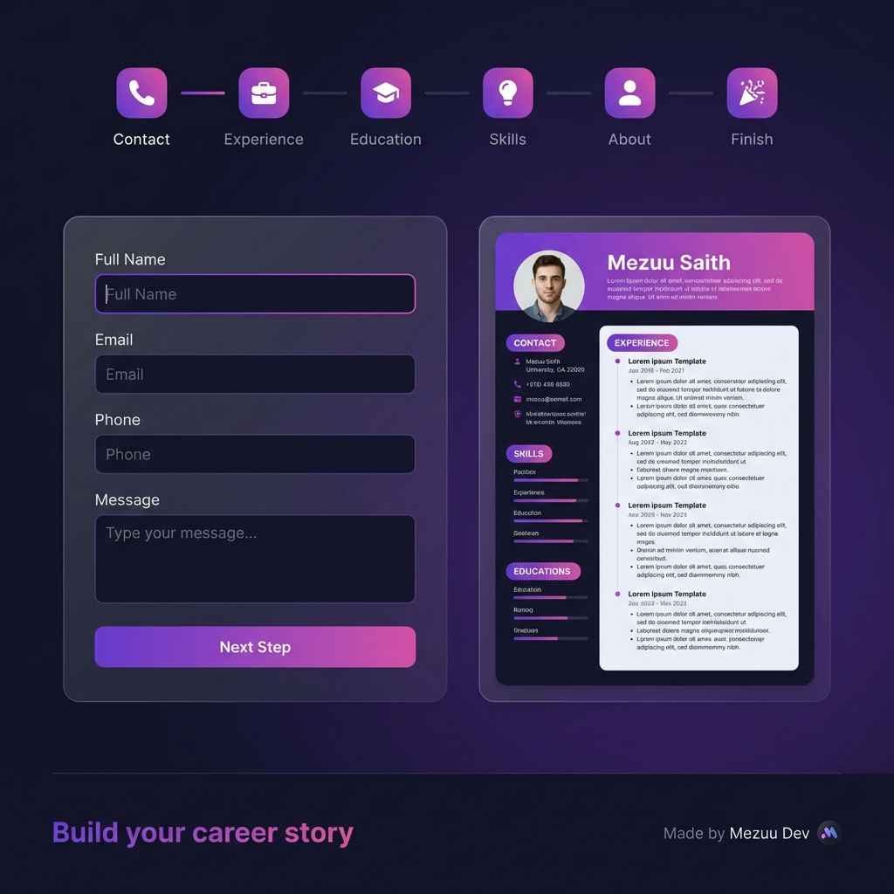

# 🎨 CV Builder

<div align="center">



**A modern, sleek CV Builder application with Gen Z aesthetics**

[](https://reactjs.org/)
[](https://vitejs.dev/)
[](https://djangoproject.com/)
[](https://tailwindcss.com/)

</div>

---

## ✨ Features

- 📝 **Multi-step Form** – Guided experience with 6 easy steps
- 🎨 **Modern Dark Theme** – Sleek purple/pink gradient aesthetics
- 🔮 **Glassmorphism UI** – Beautiful frosted glass effects
- 📱 **Live Preview** – See your CV update in real-time
- 📄 **PDF Export** – Download your CV as a professional PDF
- 💫 **Smooth Animations** – Polished micro-interactions

---

## 🛠️ Tech Stack

### Frontend
- **React 18** with Hooks
- **Vite** for blazing fast development
- **Tailwind CSS** for styling
- **react-to-print** for PDF generation

### Backend
- **Django 5** REST Framework
- **SQLite** / PostgreSQL database
- **JWT Authentication**

---

## 🚀 Getting Started

### Prerequisites
- Node.js 18+
- Python 3.10+
- pip

### Installation

1. **Clone the repository**
   ```bash
   git clone https://github.com/mezuuu/Aplikasi-CV-Builder.git
   cd Aplikasi-CV-Builder
   ```

2. **Setup Backend**
   ```bash
   cd backend
   pip install -r requirements.txt
   python manage.py migrate
   python manage.py runserver
   ```

3. **Setup Frontend**
   ```bash
   cd frontend
   npm install
   npm run dev
   ```

4. **Open in browser**
   ```
   http://localhost:5173
   ```

---

## 📸 Screenshots

### CV Builder Interface


The application features:
- Step-by-step form wizard with progress indicator
- Dark theme with purple/pink gradient accents
- Live CV preview with real-time updates
- Professional PDF export

---

## 👥 Team

Built with ❤️ by **Mezuu Dev Team**

| Role | Member |
|------|--------|
| Frontend Developer | Team Member |
| Backend Developer | Team Member |
| UI/UX Designer | Team Member |

---

## 📄 License

This project is open source and available under the [MIT License](LICENSE).

---

<div align="center">

**Made with ❤️ using Vite + React + Tailwind CSS**

</div>